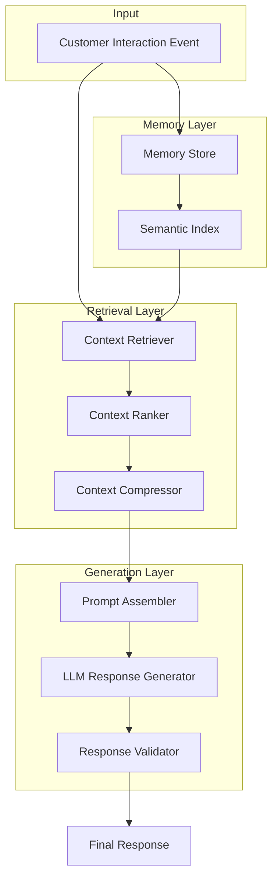
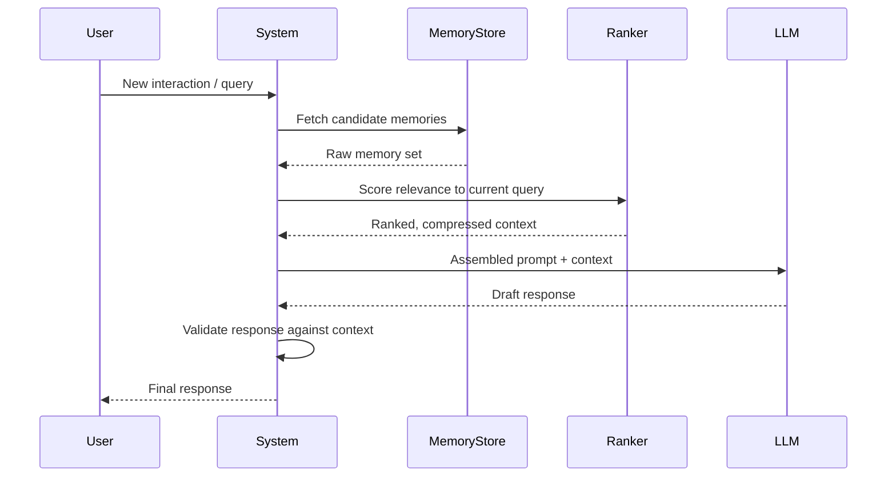
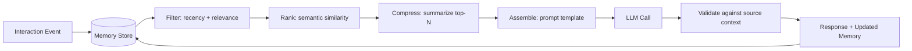

# Adaptive Context Memory CRM

**Part of the [AI Systems Portfolio](https://github.com/DayanGillani/dayan-gillani) ecosystem — Flagship Project**

## 1. Executive Summary

Adaptive Context Memory CRM is a customer relationship system that treats "memory" as a first-class engineering problem. Instead of storing customer data as flat records, it captures interaction history as structured, retrievable context — enabling AI-driven responses that stay accurate and personalized as a relationship evolves over time.

## 2. Problem Statement

Most CRMs store customer data as static fields (name, email, last contact date). When AI is layered on top for personalization — support responses, sales follow-ups, recommendations — it either:
- Re-reads the entire interaction history every time (expensive, slow, and prone to losing the point in noise), or
- Uses no historical context at all (generic, impersonal output)

Neither approach scales. There's no middle layer that decides *which* pieces of history are relevant to *this* interaction, right now.

## 3. Business Value

- Reduces AI response latency by retrieving only relevant context instead of full history
- Improves personalization quality by ranking context relevance rather than treating all past interactions equally
- Creates an auditable memory trail — every AI decision can be traced back to the context it used
- Directly reusable pattern for support systems, sales tooling, and customer success platforms

## 4. Key Features

- Long-term memory storage per customer, structured by interaction type and recency
- Semantic search over interaction history (retrieval by meaning, not just keyword)
- Context ranking — scoring stored memories by relevance to the current query
- Context compression — condensing long histories into prompt-ready summaries
- Prompt assembly layer that combines ranked context into a single, bounded prompt
- Response validation — checking AI output against the source context before it's returned

## 5. System Architecture



## 6. Workflow Design



## 7. Prompt Engineering Strategy

Prompts are assembled, not hand-written per interaction. The assembly layer separates concerns:
- **System instructions** — fixed, versioned separately from context
- **Retrieved context block** — dynamically inserted, ranked by relevance, size-bounded
- **Current query** — the live user input

This separation allows the system instructions to be improved independently of what context happens to be retrieved, and keeps prompts auditable — you can always see exactly what the model was given.

## 8. Context Engineering Strategy

Context flows through four stages before it reaches the model:
1. **Collection** — raw interaction events logged as they happen
2. **Filtering** — removing irrelevant or stale entries before ranking
3. **Ranking** — scoring remaining entries by relevance to the current query
4. **Compression** — condensing top-ranked entries into a token-bounded summary

This is treated as its own pipeline, independent of the LLM call, so it can be tested and improved in isolation.

## 9. Data Flow



## 10. Example Use Cases

- **Customer support**: surfacing only the past tickets relevant to the current issue, not the entire history
- **Sales follow-up**: recalling prior objections and preferences without a rep manually re-reading notes
- **Personalized recommendations**: grounding suggestions in actual past behavior instead of generic profiles

## 11. Screenshots Section

_To be added as the interface is built out._

## 12. Architecture Diagrams

See Section 5 (System Architecture) and Section 9 (Data Flow) above.

## 13. Agent Flow Diagrams

_Not applicable in the initial version — this project focuses on the memory/context layer. Agent orchestration is covered in the companion [Multi-Agent AI Collaboration Framework](#) project._

## 14. Context Flow Diagram

See Section 9 (Data Flow).

## 15. Installation Guide

```bash
git clone https://github.com/DayanGillani/adaptive-context-memory-crm.git
cd adaptive-context-memory-crm
pip install -r requirements.txt
```

_Full setup instructions will be added as the implementation progresses._

## 16. Future Roadmap

- [ ] Core memory store implementation
- [ ] Semantic indexing layer
- [ ] Context ranking algorithm (v1: cosine similarity, v2: learned ranking)
- [ ] Compression module
- [ ] Prompt assembly templates
- [ ] Response validation layer
- [ ] Integration point with the Context Engineering Framework (companion repo)

## 17. Repository Structure

```
adaptive-context-memory-crm/
├── README.md
├── docs/              # Design docs, decision records
├── screenshots/        # UI captures (once built)
├── architecture/        # Diagram source files
├── prompts/           # Prompt templates and versions
├── examples/           # Example interactions and outputs
└── src/               # Implementation
```

---

*This project is part of a connected AI Systems Portfolio. See the [profile](https://github.com/DayanGillani) for the full ecosystem roadmap.*
